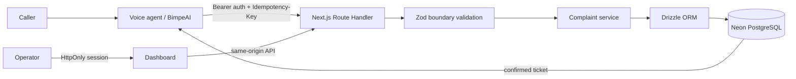

# LightLine v0.1 architecture

## Request flow



The application owns complaint validation, persistence, ticket generation, and the operations view. BimpeAI is the intended voice and channel platform; LightLine does not process audio. Database access is server-only through Drizzle’s Neon HTTP driver, which suits the app’s individual query operations. No realtime infrastructure is used: operators explicitly refresh the register.

## Database and migrations

`src/db/schema.ts` is the Drizzle source of truth. The `complaints` table stores a UUID primary key; a PostgreSQL identity `ticket_number`; generated, unique `ticket_id`; unique `idempotency_key`; request hash; complaint fields; and timestamps. Enum values are shared with the domain module. Length/hash/key checks and indexes are declared in the schema. The first migration is under `drizzle/`.

For schema edits, generate a migration and inspect the SQL before applying it:

```sh
npm run db:generate
npm run db:migrate
```

`db:migrate` reads `.env.local` and applies the migration set to `DATABASE_URL`. Point it only at the intended LightLine development or deployment database. Do not use `db:push` as the production schema workflow.

Ticket IDs are generated by PostgreSQL from an identity sequence and a stored generated expression: `LL-` plus the identity value left-padded to a minimum of four digits. It produces `LL-0001`, `LL-9999`, then `LL-10000` without truncation. Identity sequences are concurrency-safe and may have gaps; IDs are not derived from row counts. The API returns a ticket only after the insert succeeds.

## Complaint API contract

All JSON bodies are limited to 16 KiB. Unknown fields are rejected. Text values are trimmed and must remain nonblank.

### Create

`POST /api/complaints` requires `Authorization: Bearer <LIGHTLINE_TOOL_API_KEY>` and an `Idempotency-Key` header matching 8–128 characters: the first character is a letter or digit; remaining characters may be letters, digits, `.`, `_`, `:`, or `-`.

```json
{
  "category": "METER",
  "description": "Prepaid meter stopped accepting tokens since yesterday",
  "location": "Yaba",
  "callerPhone": "+2348000000000",
  "meterNumber": "45001234",
  "providerCallId": "provider-call-id-if-available",
  "source": "VOICE",
  "priority": "NORMAL"
}
```

Required fields: `category`, `description` (1–4,000 characters), `location` (1–500 characters). Optional fields: `callerPhone` (up to 32), `customerAccount` (up to 100), `meterNumber` (up to 100), `providerCallId` (up to 200), `source`, and `priority`. Categories are `METER`, `BILLING`, `SERVICE_INTERRUPTION`, `DISCONNECTION`, `VOLTAGE`, `DELAY`, and `OTHER`. Sources are `VOICE`, `OPERATOR`, and `DEMO`; priorities are `LOW`, `NORMAL`, and `HIGH`. Defaults are source `VOICE` and priority `NORMAL`. The server assigns status `OPEN`; callers cannot submit status.

New persistence returns HTTP 201:

```json
{
  "success": true,
  "complaint": { "ticketId": "LL-0193", "status": "OPEN" },
  "replayed": false
}
```

An identical retry with the same key returns HTTP 200 and the original ticket with `replayed: true`. The server hashes the canonical, validated payload and stores hash plus unique idempotency key in the complaint row. A retry with the same key but different validated data returns HTTP 409. Concurrent requests with the same key converge on the one stored row. No Redis or separate idempotency store is used.

### Operator reads and update

Operator endpoints require a valid operator session cookie.

- `GET /api/complaints?page=1&pageSize=25&category=METER&status=OPEN`: all query parameters are optional. Page starts at 1 and is capped at 100,000; page size defaults to 25 and is capped at 25. Category/status filters use the enum values above. Response: `{success, complaints, pagination: {page, pageSize, total}, overview: {open, reviewing, resolved, escalated, receivedToday}}`. Overview counts cover all complaints; `receivedToday` uses the `Africa/Lagos` calendar day.
- `GET /api/complaints/{ticketId}`: returns `{success: true, complaint}` or 404.
- `PATCH /api/complaints/{ticketId}`: requires same-origin request and strict JSON `{ "status": "REVIEWING" }`. Status must be `OPEN`, `REVIEWING`, `RESOLVED`, or `ESCALATED`. Success returns the updated complaint with ISO timestamps.

The full complaint DTO uses camelCase: `id`, `ticketId`, `callerPhone`, `customerAccount`, `meterNumber`, `category`, `description`, `location`, `priority`, `status`, `source`, `providerCallId`, `createdAt`, and `updatedAt`. Optional database values serialize as `null`.

Errors use `{success:false,error:{code,message}}`. Validation errors are 400, unsupported content type 415, oversized body 413, unauthorized requests 401, forbidden origin 403, unknown ticket 404, and conflicting idempotency key 409. Unexpected database/configuration errors return a safe 503 response without SQL details or credentials.

## Access and secrets

Required runtime variables are `DATABASE_URL`, `LIGHTLINE_TOOL_API_KEY`, and `OPERATOR_ACCESS_SECRET`. The URL must be PostgreSQL; the two distinct secrets must each have at least 32 printable characters and must not be placeholders. Use placeholders only in `.env.example`; keep actual values in ignored `.env.local` during development and the hosting provider’s secret settings in deployment. Never expose them through `NEXT_PUBLIC_*` variables.

The tool API uses a server-side bearer credential with constant-time comparison. Operators sign in with the operator secret at `/operator/login`; LightLine issues an eight-hour signed, HttpOnly session cookie, marked Secure in production and SameSite Lax. Dashboard pages and data routes are protected. Status mutation also checks the request origin. This is a small shared-secret operator gate, not per-user identity or role management.

## External service state

Current account inspection and official provider-document findings are in [PROVIDERS.md](PROVIDERS.md) and [BIMPEAI_SETUP.md](BIMPEAI_SETUP.md). A BimpeAI Development agent/workflow exists with a selected YarnGPT voice and a saved Custom API complaint action. Static and agent-driven Playground requests reached protected Preview and persisted development tickets in Neon. Required and optional fields have been verified with fictional inputs; same-key replay through the static action test returned HTTP 200 without a duplicate. A manual agent retry after success used a new key and created a duplicate, so the workflow now forbids resubmission after success. Automatic provider retry behavior and a real voice call remain unverified. Hackathon materials specify Temlio phone infrastructure through a BimpeAI SIP trunk; phone allocation is pending the host's reply to the owner. KrosAI and Spitch are unused.
